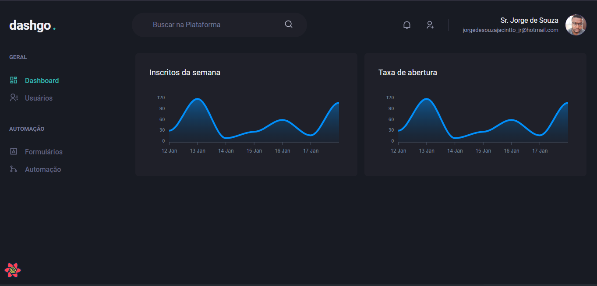
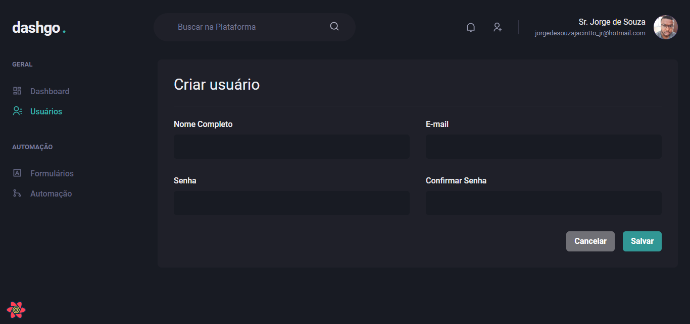

  

## **💻** Projeto

Projeto “dashGo”, dashboard criada para a conclusão de módulo durante o programa de aceleração “Ignite - ReactJS”, promovido pela Rocketseat, a fim de consolidar ainda mais meus conhecimentos sendo alinhado com as novas e melhores práticas e tecnologias disponíveis no mundo da tecnologia.  

Foi utilizado NextJS, Typescript, Yup para validações, UseQuery e CrakraUI para estilizações.

  

  

## 🚀 Tecnologias

- [ReactJS](https://reactjs.org/)
- [TypeScript](https://www.typescriptlang.org/)
- [Chakra UI](https://chakra-ui.com/)
- [Next.js](https://nextjs.org/)
- [React Hook Form](https://react-hook-form.com/)
- [Yup](https://www.npmjs.com/package/yup)
- [React Query](https://react-query.tanstack.com/)
- [Mirage JS](https://miragejs.com/)
- [apexcharts](https://apexcharts.com/)
- [ESLint](https://eslint.org/)
- [Faker](https://fakerjs.dev/)

## 📝 License

Esse projeto está sob a licença MIT. Veja o arquivo [LICENSE](https://github.com/srsouzaj/dashgo/blob/master/LICENSE.MD) para mais detalhes.

Feito por Jorge de Souza

---
